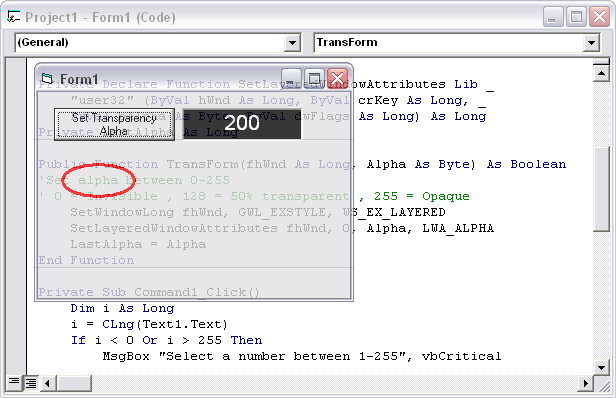



## Semi\-Transparent forms with fade effects \(See screenshot to believe\!\)

### Description

Believe that!

Yo can make your forms semi-transparent just with a few lines code.

This from loads and unloads with a alpha fade effect.

You can set Alpha Blending between 1-255.

Download , Feedback and vote plzzzzzzzzzzz.

OS : ONLY win2000 and winXP.
 
### More Info
 

             |
---                |---
**Submitted On**   |2002-07-26 13:32:40
**By**             |[ali s](https://github.com/Planet-Source-Code/PSCIndex/blob/master/ByAuthor/ali-s.md)
**Level**          |Advanced
**User Rating**    |4.2 (59 globes from 14 users)
**Compatibility**  |VB 5\.0, VB 6\.0
**Category**       |[Graphics](https://github.com/Planet-Source-Code/PSCIndex/blob/master/ByCategory/graphics__1-46.md)
**World**          |[Visual Basic](https://github.com/Planet-Source-Code/PSCIndex/blob/master/ByWorld/visual-basic.md)
**Archive File**   |[Semi\-Trans1108787262002\.zip](https://github.com/Planet-Source-Code/ali-s-semi-transparent-forms-with-fade-effects-see-screenshot-to-believe__1-37265/archive/master.zip)

### API Declarations

2 functions,3 constants

